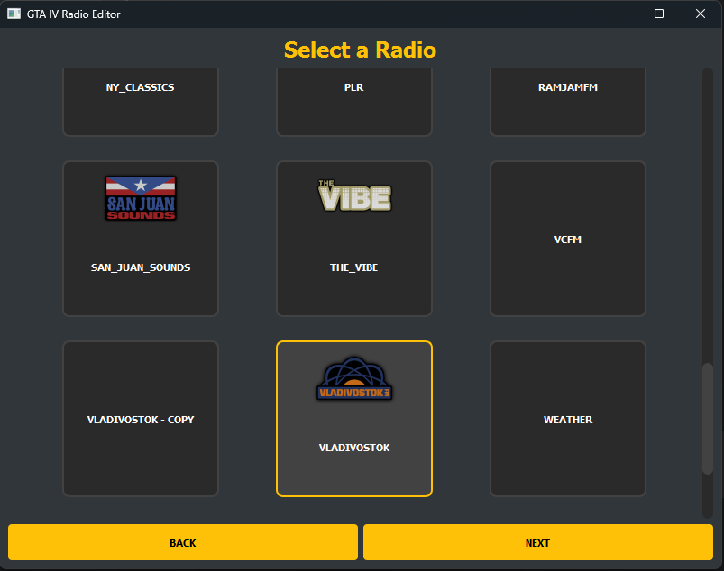
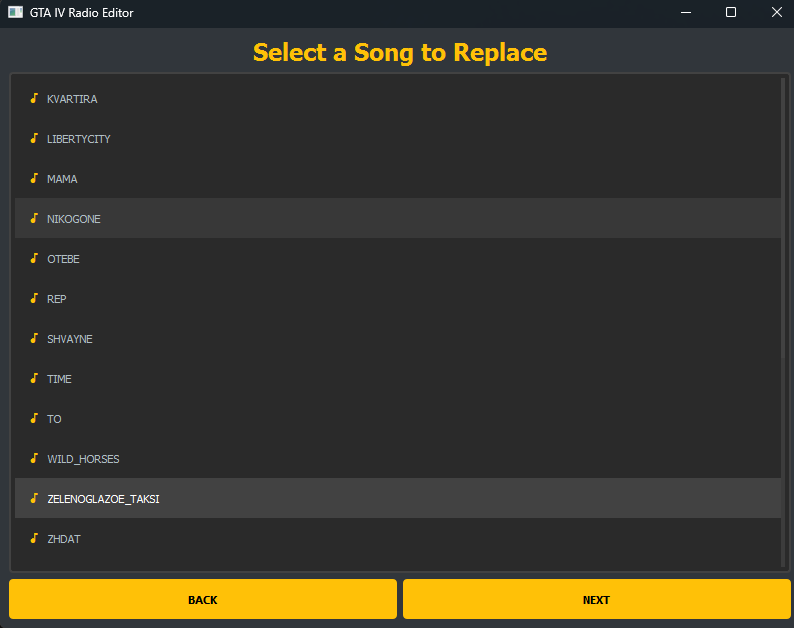

# GTA IV Modding Toolkit

A Windows desktop toolkit for modifying Grand Theft Auto IV assets.

[](https://github.com/Heidric/GTAIVModdingToolkit/actions/workflows/tests.yml)
[](https://github.com/Heidric/GTAIVModdingToolkit/actions/workflows/portable-windows.yml)

See [RELEASE_NOTES.md](RELEASE_NOTES.md) for the current release summary.

<div style="display: flex; justify-content: space-between; margin: 20px 0;">
    
    
</div>

## Current scope

The toolkit modifies existing radio-track slots, existing radio-station logo textures, existing entries in RPF2, RPF3, and IMG3 archives, and existing textures inside WTD dictionaries or supported WDR drawables. It does not create new stations, track slots, archive entries, archive directories, or texture records.

Implemented features:

- Browse GTA IV radio stations and their existing track slots.
- Preview extracted station tracks from the application.
- Replace one track at a time through a staged, verified transaction.
- Replace multiple tracks in one transactional batch.
- Automatically match batch input files to track slots by normalized filename.
- Review and change every batch mapping before processing.
- Prevent duplicate target slots within one batch.
- Update track durations in `sounds.dat15`.
- Preserve non-standard OAF timestamp and channel layouts when they cannot be safely rewritten.
- Remember the last directory used by game, audio, and other file pickers.
- Replace an existing station logo from PNG, WebP, JPEG, BMP, or TGA input.
- Preview selected and unselected logo variants before installation.
- Install radio-logo WTD changes transactionally in FusionFix or direct mode.
- Restore the previous complete radio-logo state from the application.
- Run a production preflight for dependencies, WTD sources, image input, and write access.
- Render the active in-game station logos in the station-selection page.
- Write rotating per-user application logs and create redacted support bundles from the start page.
- Detect common local GTA IV installations and remember the selected replacement method.
- Restore the latest paired station-RPF and `sounds.dat15` audio state from the UI.
- Run packaged-resource, dependency, installation, and write-access checks from the UI or command line.
- Browse arbitrary RPF2 and RPF3 archives as nested directory and file trees.
- Inspect size and offset metadata and export any existing RPF entry.
- Replace any existing RPF entry through staged verification, timestamped backup, atomic commit, and rollback.
- Inspect WTD texture dictionaries, including dimensions, format, mip count, and payload size.
- Preview extractable WTD textures and export them as DDS files.
- Replace existing DXT1, DXT5, and A8R8G8B8 texture payloads from an image while preserving the WTD layout and unrelated bytes.
- Open the directory containing the latest generic archive backup from the browser.
- Open GTA IV `.img` archives that use the IMG3 format.
- Filter loaded archive entries by a case-insensitive substring of their name.
- Inspect and replace embedded textures inside supported WDR drawables.
- Queue replacements across multiple WTD and WDR entries and apply them in one verified archive transaction.
- Permanently retain the first backup of an archive and keep a configurable number of newer rolling backups.

### Input formats

The single-track and batch pickers accept:

- MP3
- WAV
- OGG
- FLAC
- AAC
- M4A

Actual decoding is performed through FFmpeg and pydub, so support also depends on the installed FFmpeg build.

## Safety model

### FusionFix mode — recommended

FusionFix mode creates or updates override files under:

```text
<gtaiv>/update/pc/audio/sfx/
<gtaiv>/update/pc/audio/config/
```

The original files under `pc/audio/...` remain untouched.

### Direct replacement mode — risky

Direct mode modifies the original files under:

```text
<gtaiv>/pc/audio/sfx/
<gtaiv>/pc/audio/config/
```

Before modification, the toolkit creates timestamped backups next to the original RPF and `sounds.dat15` files.

### Transactional single-track replacement

Single-track replacement operates on staging copies of the selected station RPF and `sounds.dat15`:

1. The existing track is extracted and converted inside a temporary workspace.
2. Duration metadata is updated only in the staged `sounds.dat15`.
3. The converted track is packed only into the staged RPF.
4. The staged RPF is reopened and the replacement is extracted again for SHA-256 verification.
5. Direct mode creates timestamped backups only after staging and verification succeed.
6. The active RPF and `sounds.dat15` are replaced together; a failed final swap restores both previous files.

Cancellation is cooperative and is honored before the commit starts. A failed or cancelled operation does not leave a partial FusionFix override or a half-updated direct installation.

### Transactional batch replacement

Batch replacement operates on staging copies of both the selected station RPF and `sounds.dat15`:

1. Every selected source file is validated, extracted, and converted.
2. Duration metadata is updated in the staged `sounds.dat15`.
3. Every converted track is packed into the staged RPF.
4. Oversized entries are relocated instead of overwriting adjacent RPF data.
5. The staged RPF is reopened.
6. Every replacement is extracted again and compared with the packed source using SHA-256.
7. Active files are replaced only after all conversions and verification checks pass.

A failed or cancelled batch does not commit partial staged changes. If the final file swap itself fails, the worker restores rollback copies.

### Audio recovery history

Before a verified single or batch replacement commits, the toolkit captures the active station RPF and global `sounds.dat15` as one recovery state under `<gtaiv>/.gtaiv_toolkit/audio-history/`. Same-volume files use hard links when available and fall back to copies. History is bounded per replacement mode.

Recovery always restores the latest paired state for the current mode. The displaced active state is captured first, so running recovery again reverses the recovery. A failed two-file recovery swap restores the state that was active when recovery began.

### Transactional generic archive and texture replacement

Generic RPF/IMG entry replacement and WTD/WDR texture replacement use the same fail-closed model as the audio tools:

1. The selected RPF is copied to a staging archive in the same directory.
2. The existing entry is replaced only inside the staging archive.
3. The staging archive is reopened, its entry set and unrelated metadata are checked, and the replacement bytes are verified with SHA-256.
4. A timestamped backup of the original RPF is created and verified.
5. The staging archive atomically replaces the active archive.
6. The committed archive is reopened and verified again.
7. A failed final swap or post-commit verification restores the original archive from the verified backup.

Individual WTD or embedded WDR texture replacement first creates and verifies a surgical resource patch, then passes the complete modified entry through transactional archive replacement. The original RSC5 header, texture records, and every unrelated payload byte remain unchanged.

Queued replacement groups multiple WTD/WDR texture edits by entry, patches every affected entry once, writes all entries to one staging archive, verifies the complete batch, creates one backup, and commits once. A failed batch does not modify the active archive.

The browser serializes file operations and prevents the application from closing while a worker is reading, exporting, or modifying an archive. The first backup of each archive is retained permanently; the number of additional rolling backups is configurable in Settings and defaults to three.

## Archive handling

The toolkit vendors a patched copy of `pyrpfiv` under `vendor/pyrpfiv/` and includes an IMG3 parser for GTA IV `.img` archives. The generic browser follows nested RPF directory entries, presents stable full paths, reads exact logical entry bytes, and exports without flattening the archive structure. RPF2 names are decoded from the TOC string table, RPF3 names are resolved from known filename hashes, and IMG3 entries expose their stored names.

When replacing an archive entry:

- only an existing entry can be targeted;
- the existing RPF2 string-table name reference or RPF3 name hash and TOC position are preserved;
- all unrelated entry paths and metadata must remain unchanged;
- a replacement that fits remains at its current offset;
- a replacement that exceeds the current slot is appended at an `0x800`-aligned end-of-file offset;
- encrypted and unencrypted RPF2 and RPF3 TOCs are updated in their native layouts;
- RPF2 resource entries preserve their resource type, validate the replacement RSC5 header, and keep the resource type packed into the low byte of the TOC offset;
- compressed non-resource RPF2 entries are exported as logical bytes and recompressed when replaced;
- relocated offsets are constrained to the representable range of the selected RPF version;
- the source bytes, staged bytes, backup, and committed bytes are verified before success is reported.

The `0.16.0` browser does not add, delete, rename, or move archive entries and does not edit archive directory structures.

## GTAIV.exe compatibility

The parser needs the GTA IV RPF AES key. The toolkit first checks known key offsets for established executable versions:

- 1.0.4.0
- 1.0.4r2
- 1.0.6.0
- 1.0.7.0
- 1.0.8.0
- 1.2.0.32
- 1.2.0.43
- 1.2.0.59

If those offsets do not match, the toolkit scans the selected `GTAIV.exe` for the same already-known key bytes at another location. This supports executable builds where the known key moved, but it cannot derive a genuinely new or obfuscated key.

An explicit key can be supplied through the vendored parser API, although the GUI does not currently expose that override.

## Requirements

- Grand Theft Auto IV.
- FFmpeg and FFprobe available through `PATH` for audio replacement.
- FusionFix for the recommended override-based replacement mode.

Python 3.12 is required only when running from source. The portable Windows build includes the Python runtime and application dependencies.

The application starts without FFmpeg so logo tools, recovery, settings, and diagnostics remain available. Audio replacement checks for FFmpeg when an audio operation starts and can offer installation at that point.

Episodes from Liberty City support has not been validated.

## Installation

### Portable Windows build

Download the `GTAIVModdingToolkit-windows-*.zip` artifact from the **Portable Windows Build** workflow, extract the complete directory, and run `GTAIVModdingToolkit.exe`. Keep the `_internal` directory beside the executable.

### Run from source

```bash
git clone https://github.com/Heidric/GTAIVModdingToolkit.git
cd GTAIVModdingToolkit
py -3.12 -m venv .venv
.venv/Scripts/python.exe -m pip install --upgrade pip
.venv/Scripts/python.exe -m pip install -r requirements.txt
```

Run the application:

```bash
.venv/Scripts/python.exe app.py
```

## Usage

### Startup settings

The start page reuses the last valid GTA IV directory and replacement method. When no saved installation is available and automatic detection is enabled, the toolkit checks `GTAIV_PATH`, Steam's registered installation and `libraryfolders.vdf`, and common Rockstar Games Launcher and Epic Games locations.

On Windows, discovery also checks a bounded list of common game folders on each fixed local drive, including `Games`, `GOG Games`, and `Rockstar Games`. It does not recursively scan entire disks.

Select **Detect** to run discovery manually and choose between multiple installations. A valid game directory must contain both `GTAIV.exe` and `pc/audio/sfx`.

Open **Settings & About** to change the saved installation, select the default replacement method, enable or disable automatic detection, view build metadata, or open the application log directory.

Select **Run System Check** in **Settings & About** to verify packaged resources, Python dependencies, FFmpeg/FFprobe availability, the selected GTA IV installation, FusionFix, radio archives, logo textures, and destination write access. Missing FFmpeg is reported as a warning because non-audio features remain usable.

The same report is available from the command line:

```bash
.venv/Scripts/python.exe app.py --doctor --gtaiv-path "D:\Games\Grand Theft Auto IV"
.venv/Scripts/python.exe app.py --doctor --gtaiv-path "D:\Games\Grand Theft Auto IV" --direct
```

Use `--packaged-only` to check application resources and dependencies without requiring a GTA IV installation.

### RPF Browser

1. Select a valid GTA IV installation on the start page and open **RPF Browser**.
2. Choose an `.rpf` or `.img` archive and select **Open**.
3. Browse the entry tree or narrow the loaded snapshot with **Name filter**. Any selected file can be exported or transactionally replaced with an external file.
4. Select a `.wtd` entry, or a supported `.wdr` entry with embedded textures, to inspect its texture table.
5. Select an extractable texture to preview it or export it as DDS/PNG.
6. For DXT1, DXT5, or A8R8G8B8 textures, either replace the selected texture immediately or add it to the replacement queue.
7. Review queued replacements, verify the current and replacement previews, and apply the queue as one archive transaction.
8. Wait for staging, backup creation, commit, and final verification to finish before closing the application or starting the game.
9. Use **Open latest backup folder** to locate retained backups after a successful replacement.

Replacing an entire `.wtd` through **Replace selected entry from file** is distinct from replacing one texture payload. For an RPF2 resource entry, the external file must contain an RSC5 header with the same resource type as the existing entry; the parser validates the header and updates matching resource flags in the TOC. Individual texture replacement preserves the existing WTD structure and is limited to supported texture formats.

### Single-track replacement

1. Select the GTA IV installation directory.
2. Select FusionFix or direct replacement mode.
3. Select a radio station.
4. Select an existing track slot.
5. Select an MP3, WAV, OGG, FLAC, AAC, or M4A replacement.
6. Wait for staging, conversion, byte verification, and commit to complete.
7. Test the modified station in game.

### Batch replacement

1. Open a radio station.
2. Select **Batch Replace**.
3. Add one or more audio files.
4. Review or change the target slot assigned to each file.
5. Confirm that every target slot is unique.
6. Select **Replace All**.
7. Wait for conversion, staging, byte verification, and commit to complete.
8. Test the modified station in game.

The batch page displays the number of replaceable slots, selected files, and remaining slots before processing starts.

### Audio recovery

Open **Audio Recovery** from the station-selection page. The page shows the latest paired audio state for the current FusionFix or direct mode, including the affected station and whether the previous RPF and `sounds.dat15` existed. Select **Restore Previous Audio State** to restore both files transactionally.

### Radio-logo replacement and recovery

1. Open **Radio Logo Tools** from the station-selection page.
2. Select GTA IV, TLAD, or TBoGT as the texture target.
3. Select an existing station and an input image. Transparent PNG or WebP input is recommended.
4. Choose **Fit**, **Fill**, or **Stretch**, and adjust safe padding.
5. Review the selected/color and unselected/grayscale previews.
6. Select **Install Station Logo** and confirm the transactional installation.
7. To undo the latest logo operation, open the **Recovery** tab and select **Restore Previous Logo State**.

The image workflow changes existing `_col` and `_bw` payloads while preserving the original WTD resource layout. Generated package directories are temporary unless explicitly requested through the backend API.

After installation or recovery, returning to the station-selection page rebuilds its icons from the active GTA IV WTD files. The displayed icon therefore follows the current direct or FusionFix texture state instead of the bundled identification image.

Recovery operates on one complete backup batch. In direct mode it restores the newest timestamped WTD backups. In FusionFix mode it restores the newest override backups, or removes the first override batch so the game falls back to its original WTD files. The displaced active state is backed up, allowing the recovery operation itself to be reversed.

### Diagnostics and support bundles

The application writes rotating text logs under the current user's local application-data directory. On Windows the default location is:

```text
%LOCALAPPDATA%\GTAIVModdingToolkit\logs\
```

Select **Create Support Bundle** on the start page to export a ZIP containing:

- application version and build metadata;
- Windows and Python runtime details;
- FFmpeg and bundled-tool availability;
- presence, size, and modification time for relevant GTA IV paths;
- a limited tail of recent application logs.

The bundle does not include GTA IV executables, RPF/WTD archives, audio, replacement images, or other game-file contents. Known user-home, temporary, and selected GTA IV paths are replaced with placeholders. Review the ZIP before sharing it.

### WTD write safety

The production image workflow uses **surgical payload patching**. It preserves the original RSC5 header, virtual metadata, texture table, dimensions, formats, mip counts, and every physical byte outside the selected texture payloads. The **Check Readiness** action verifies Pillow, the texfury encoder, station source WTDs, the input image, temporary storage, and destination write access before installation.

Full WTD reconstruction through texfury dictionary saving or FusionFix ResourceBuilder remains available only for development diagnostics. These paths are not used by the GUI installation workflow and require explicit acknowledgement:

```bash
python -m core.radio_logo.texture_dictionary --help
python -m core.radio_logo.resource_builder --help
```

Pass `--experimental` to the selected command, pass `allow_experimental=True` through the Python API, or set `GTAIV_TOOLKIT_ENABLE_EXPERIMENTAL_WTD_REBUILD=1`. Experimental output must not be treated as production-safe merely because structural validation succeeds.

## Reverting changes

### Generic RPF Browser changes

Every successful generic entry or texture replacement retains a timestamped `.rpf` backup beside the modified archive. The browser can open the directory containing the latest backup, but `0.16.0` does not automatically restore generic RPF backups.

To restore one manually, close the game and the toolkit, keep the modified archive as an additional safety copy, and replace it with the corresponding verified backup. Do not restore a backup from a different game version or a different archive path.

### FusionFix mode

Radio-logo changes can be reverted from **Radio Logo Tools → Recovery**. Manual removal is also possible by deleting the relevant `radio_hud*.wtd` files under the matching texture directory:

```text
<gtaiv>/update/pc/textures/
<gtaiv>/update/TLAD/pc/textures/
<gtaiv>/update/TBoGT/pc/textures/
```

Use **Audio Recovery** to restore the latest paired station RPF and `sounds.dat15` state. Manual deletion remains possible, but deleting the shared override `sounds.dat15` can revert duration metadata for multiple stations at once.

### Direct replacement mode

Use **Audio Recovery** for the latest paired audio state and **Radio Logo Tools → Recovery** for the latest complete radio-logo state. Direct-mode timestamped backups remain beside modified files. If no usable recovery state remains, restore the original game files through the game platform's file-verification mechanism.

## Development and tests

Install the test dependencies:

```bash
.venv/Scripts/python.exe -m pip install -r requirements-test.txt
```

Run the regression suite:

```bash
.venv/Scripts/python.exe -m pytest -q
```

Compile-check the tested Python modules:

```bash
.venv/Scripts/python.exe -m compileall -q core ui vendor tests
```

Build the portable Windows directory locally:

```bash
.venv/Scripts/python.exe -m pip install -r requirements-build.txt
.venv/Scripts/python.exe -m PyInstaller --clean --noconfirm packaging/GTAIVModdingToolkit.spec
dist/GTAIVModdingToolkit/GTAIVModdingToolkit.exe --smoke-test
dist/GTAIVModdingToolkit/GTAIVModdingToolkit.exe --doctor --packaged-only
```

The portable workflow runs the regression suite, builds the one-directory application, smoke-tests and system-checks the packaged executable, and publishes a ZIP artifact.

GitHub Actions runs the compile check and test suite on Windows with Python 3.12 for pushes and pull requests.

The synthetic tests do not require GTA IV files and cover:

- AES-key normalization and unknown-offset scanning;
- encrypted and unencrypted RPF3 TOCs;
- capacity calculation from the next entry or archive end;
- in-place replacement with smaller and exact-capacity payloads;
- oversized-entry relocation to aligned EOF;
- preservation of adjacent entries;
- TOC persistence after reopening an archive;
- extracted-byte verification;
- missing-path and invalid-offset failures;
- transactional single-track staging, verification, cancellation, and rollback;
- paired audio-history capture, reversible recovery, and failed-swap rollback;
- support-bundle path redaction, log collection, and archive contents;
- GTA IV installation discovery and preference persistence.
- nested RPF2/RPF3 directory traversal, string-table/hash name resolution, exact logical entry reads, and export overwrite handling;
- transactional generic RPF replacement, relocation, backup verification, and post-commit rollback;
- WTD metadata inspection, DDS export, bounded PNG preview, and duplicate texture-name handling;
- index-addressed surgical texture replacement with unrelated physical and virtual bytes preserved;
- combined RPF/WTD texture transactions and browser worker-boundary/lifecycle checks.

## Third-party components

### RAGE Audio Toolkit and GTA IV Audio Editor

Created by [AndrewMulti](https://github.com/AndrewMulti). The bundled command-line tools are used for extracting and rebuilding GTA IV audio assets and `sounds.dat15` metadata.

### BASS Audio Library

Developed by [Un4seen Developments](https://www.un4seen.com/). Runtime components used by the bundled audio tools include BASS, BASSmix, and BASSenc.

### pyrpfiv

The project vendors and modifies `pyrpfiv`, originally by gmroder, under its MIT license. See:

- `vendor/pyrpfiv/LICENSE`
- `vendor/pyrpfiv/THIRD_PARTY_NOTICES.md`

### GTA Forums community

The original radio-replacement workflow was informed by MeshugaPalejo's GTA Forums guide to replacing songs on existing radio stations.

## Legal and safety notice

Use the toolkit only with game files you are legally entitled to modify. The repository does not include GTA IV game archives or executable files.

Radio-station logos included under `assets/` are used for identification in this non-commercial fan-made project. The logos were sourced from *HQ Radio Icons 1.2* by Sborges98. Rights to GTA IV and its original assets belong to their respective owners.

## License

The toolkit is licensed under the MIT License. See [LICENSE](LICENSE).
